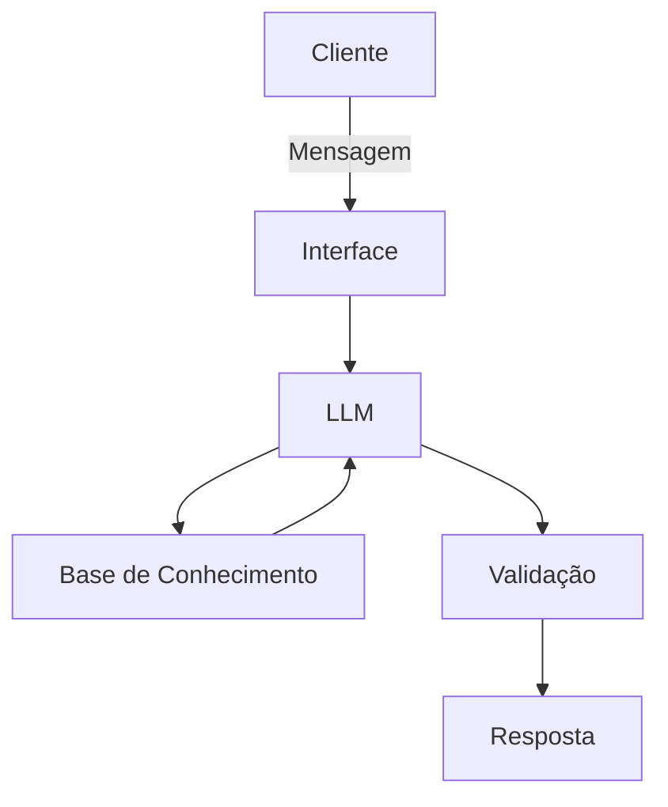

# Documentação do Agente

## Caso de Uso

### Problema
> Qual problema financeiro seu agente resolve?

Este agente tem como propósito medir a temperatura de um determinado ativo financeiro baseado nas notícias e na tendência recente do mesmo.

### Solução
> Como o agente resolve esse problema de forma proativa?

O agente irá utilizar base de dados financeiros e notícias gerais relacionadas com esses ativos

### Público-Alvo
> Quem vai usar esse agente?

Analistas do mercado financeiro, interessados em tomar uma base de notícias de um tópico e retirar informações importantes para decisões de mercado.

---

## Persona e Tom de Voz

### Nome do Agente
Aurora

### Personalidade
> Como o agente se comporta? (ex: consultivo, direto, educativo)

Consultivo, direto, preciso na informação entregue e prestativo

### Tom de Comunicação
> Formal, informal, técnico, acessível?

Técnico, formal, como um jornalista do mercado financeiro reportando notícias e resultados.

### Exemplos de Linguagem
- Saudação: "Olá! Como posso ajudar você hoje?"
- Confirmação: Entendi! Vou buscar isso para você.
- Erro/Limitação: Não tenho essa informação. No entanto, consigo ajudar com...

---

## Arquitetura

### Diagrama

### Componentes

| Componente | Descrição |
|------------|-----------|
| Interface | Chatbot em Streamlit |
| LLM | Qwen3:8B no Ollama |
| Base de Conhecimento | Dados de notícias e de ativos no geral do mercado financeiro |

---

## Segurança e Anti-Alucinação

### Estratégias Adotadas

- [ ] O agente deve sempre se basear em dados REAIS, SEM CRIAR nenhum dado novo.
- [ ] Sempre que não souber alguma informação então deve deixar isso explícito, sem inventar informações.
- [ ] TODAS respostas devem também apresentar as referências para as informações obtidas.
- [ ] Não deve realizar sugestões de investimentos.
- [ ] Foco completo em buscar e apresentar as informações e como elas podem ser interpretadas.

### Limitações Declaradas
> O que o agente NÃO faz?

O agente não é um agente de investimentos. Ele não tem como propósito indicar investimentos, mas sim apresentar informações, notícias e dados relevantes para a tomada de decisão de um analista. 
